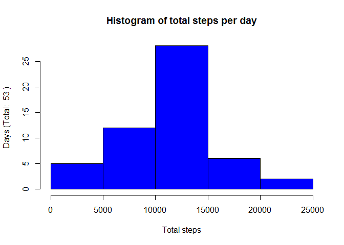
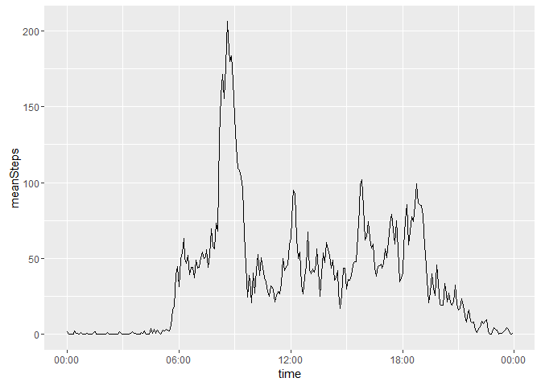
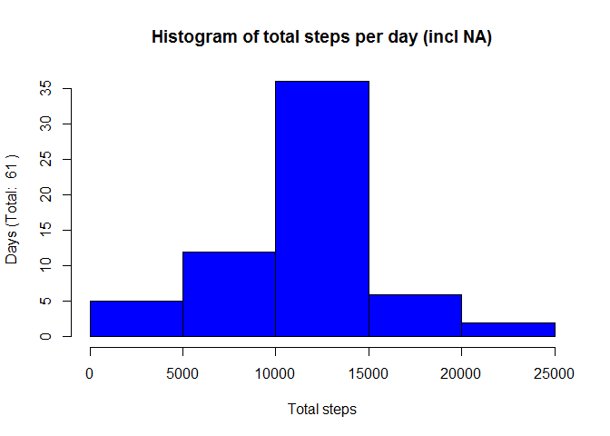
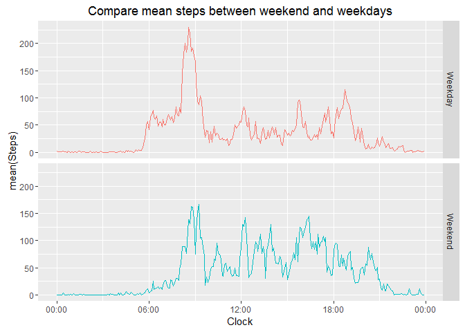

# Reproducible Research: Peer Assessment 1


# Activity Montoring Device Analysis

## Loading and preprocessing the data

For ease of use the data will transformed into a data.table.

```r
filename <- "activity.csv"
DFactivities <- read.csv(filename,stringsAsFactors = F)
library(data.table)
```

```
## Warning: package 'data.table' was built under R version 3.2.5
```

```r
DTactivities <- data.table(DFactivities)
```

## Questions to be addressed

### 1 What is mean total number of steps taken per day?

The following histogram shows distribution of total steps per day.

```r
stepsPerDay <- DTactivities[is.na(steps)==F, .(steps=sum(steps)),by=.(date)]
hist(stepsPerDay$steps, col="blue", main="Histogram of total steps per day", xlab="Total steps", ylab=paste("Days (Total: ", nrow(stepsPerDay), ")"))
```

<!-- -->

**Finding**: *Obviously during most days the total number of steps is between 10.000 and 15.000*

The mean value of steps is: **10766** and the median value of steps is: **10765**

**NOTE: NA values are excluded from the analysis**  


### 2 What is the average daily activity pattern?

The following plot shows the average steps over all days for a given interval. 

Prozessing steps:  
 1. calculate the mean of steps by interval and store result  
 2. transform interval into a time object using library "chron"  
 3. set environment timezone to "GMT" to avoid, that R is adding hours. 


```r
library(chron)
```

```
## Warning: package 'chron' was built under R version 3.2.5
```

```r
library(ggplot2)
meanPerInterval <- DTactivities[is.na(steps)==F, .(meanSteps=mean(steps) ),by=.(interval)]
meanPerInterval[,time:=times(format(strptime(sprintf("%04d",interval), format="%H%M"), format = "%H:%M:00"))]
Sys.setenv(TZ='GMT')
g <- ggplot(meanPerInterval, aes(time, meanSteps))
g <- g + geom_line()
g <- g + scale_x_chron(format="%H:%M")
print(g)
```

<!-- -->

**Finding**: *In average the highest activity level is between 8:00 and 9:00 in the morning!*

The maximum number of steps is during the interval: 835, 206.1698113, 08:35:00

**NOTE: NA values are excluded from the analysis**  


### 3 Imputing missing values

Total number of observatons is 17568 and 2304 have "NA" as steps!


To include observations with "NA" the following logic has been applied:

1. Calculate the mean value for a given interval
2. Apply the mean value for a given interval to obervations with "NA" steps.
3. Create a new data.table with the same columns as the original dataset, but with "NA" steps replaces by mean value.
4. Calculate total steps per day with corrected NA observations.
5. Show histogram in the same way like in step 1.


```r
DTactivities[, meanSteps:=mean(steps,na.rm=T) ,by=.(interval)]
DTactivities[is.na(steps)==T,correctedSteps:=as.integer(meanSteps)]
DTactivities[is.na(steps)==F,correctedSteps:=steps]
DTactivities0NA <- DTactivities[,.(interval,date,steps=correctedSteps)]
DTstepsPerDay <- DTactivities0NA[,.(totalSteps=sum(steps)),by=.(date)]
hist(DTstepsPerDay$totalSteps, col="blue", main="Histogram of total steps per day (incl NA)", xlab="Total steps", ylab=paste("Days (Total: ", nrow(DTstepsPerDay), ")"))
```

<!-- -->

**Finding**: *Total number of days increased by 7. Obviously for some days there were no observations at all, which forced these days off the analysis!*

The mean value of steps with NA included is: **10749** and the median value of steps is: **10641**

**Finding**: *Mean and median both decreased by including the NA observation. That could be a sign, that especially intervals with a low mean steps had NA, which pulled down the mean and median*

### 4 Are there differences in activity patterns between weekdays and weekends?

To evaluate weekdays against weekend the dataset with replaced NA values was processed like this:

1. Convert column date to Date class and extract the weekday
2. Introduce a new column dayType which represents the weekend for Sa/So and weekdays for the rest
3. Convert interval into a time class to create a proper time series.


```r
DTactivities0NA[,weekday:=weekdays(as.Date(date,format="%Y-%m-%d"), abbreviate=T)]
DTactivities0NA[,dayType:="Weekday"]
DTactivities0NA[weekday=="Sa" | weekday=="So",dayType:="Weekend"]
DTactivities0NA[,time:=times(format(strptime(sprintf("%04d",interval), format="%H%M"), format = "%H:%M:00"))]
DTmeanPerIntervalWeekend <- DTactivities0NA[, .(meanSteps=mean(steps) ),by=.(time,dayType)]
Sys.setenv(TZ='GMT')

g <- ggplot(DTmeanPerIntervalWeekend, aes(time, meanSteps))
g <- g + geom_line(aes(color=dayType)) + facet_grid(dayType~.) 
g <- g + theme(legend.position="none") + ggtitle("Compare mean steps between weekend and weekdays") +xlab("Clock") + ylab("mean(Steps)")
g <- g + scale_x_chron(format="%H:%M")
print(g)
```

<!-- -->

**Finding**: *Obviously and not suprisingly, activities during the weekend start at least 1-2h later. But during the weekend there is more activity all over the day.!*  
